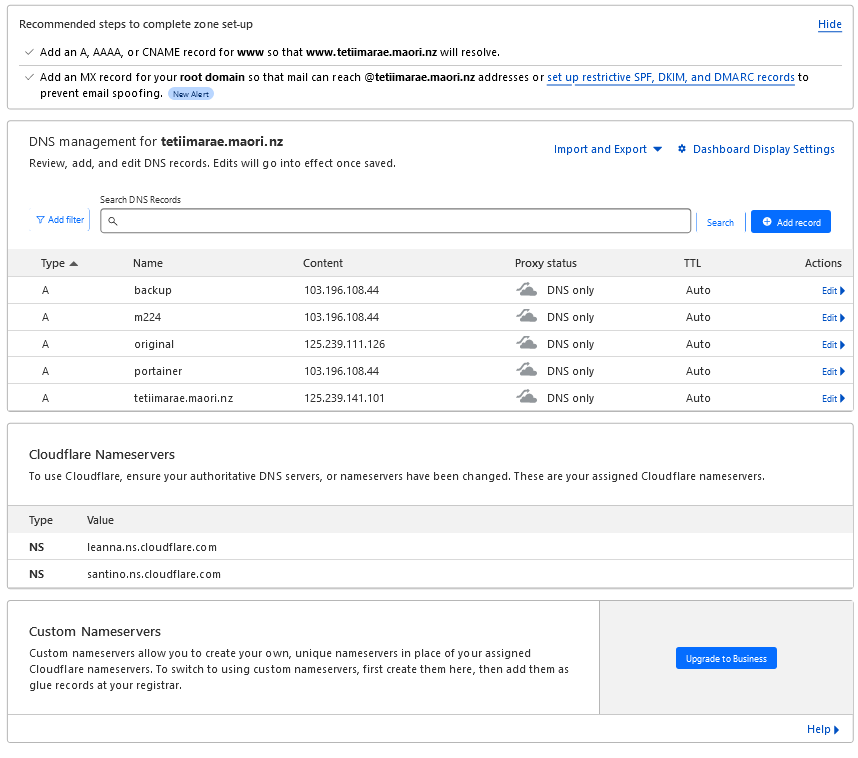

Cloudflare is used to administer the DNS and allow updating.

https://dash.cloudflare.com/login

Login is ian.welch@vuw.ac.nz

Domain name registrar is iwantmyname.

Point at the cloudflare nameservers.

Some work is outstanding as below.

